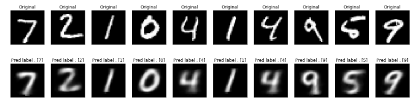


### CapsNet in PyTorch 1.4

A Capsule Network with Dynamic routing based on https://arxiv.org/abs/1710.09829 for MNIST classification.

Figure below shows the result of the reconstruction network. From the figure, it can be clearly seen that the Capsule Network was able to learn the features of the digits such as orientation, thickness and skewness.

